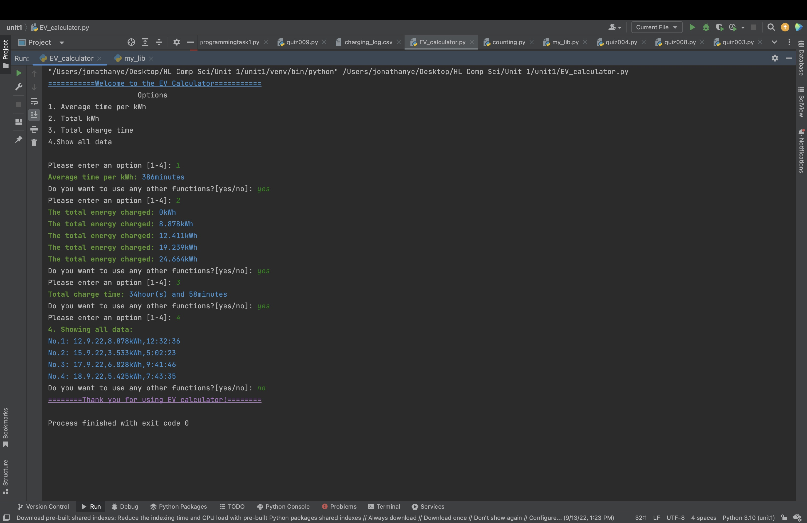

# EV Calculator
This is a example program for writing and reading files in Python

## Python Code


```.py
from my_lib import validate_int_input, colors, fonts, bold_green, end_code

welcome_msg = "Welcome to the EV Calculator".center(50, "=")
prompt_msg = "Please enter an option [1-4]: "

print(f"{colors[3]}{fonts[3]}{welcome_msg}{end_code}")
print("Options".center(50))

menu = """1. Average time per kWh
2. Total kWh
3. Total charge time
4.Show all data
"""
print(menu)
def Main():
    option = validate_int_input(prompt_msg)
    while option > 4 or option < 1:
        option = validate_int_input(f"{colors[1]}Invalid option.{prompt_msg}{end_code}")

    with open("charging_log.csv", "r") as file:
        ev_logs = file.readlines()

    # Option 1: Calculate time
    if option == 1:
        total_time = 0
        total_kwh = 0
        i = 0
        for line in ev_logs:
            if i > 0:
                data = line.split(",")
                # print(data)
                temp_time = data[2]
                temp_time = temp_time.split(":")
                temp_time = int(temp_time[0]) * 60 + int(temp_time[1])
                total_time += temp_time
                kWh = data[1]
                total_kwh = float(kWh[0:5])
            i += 1
        print(f"{bold_green}Average time per kWh: {end_code}{colors[3]}{int(total_time / total_kwh)}minutes{end_code}")

    # Option 2: Calculate total energy
    if option == 2:
        index = 0
        total_energy = 0
        for log in ev_logs:
            if index > 0:
                values = log.split(",")
                date = values[0]
                energy = values[1]
                time = values[2]
                total_energy += float(energy[0:5])
            index += 1
            print(f"{bold_green}The total energy charged: {end_code}{colors[3]}{total_energy}kWh{end_code}")

    # Option 3: Total charge time
    if option == 3:
        total_time = 0
        i = 0
        for line in ev_logs:
            if i > 0:
                data = line.split(",")
                temp_time = data[2]
                temp_time = temp_time.split(":")
                temp_time = int(temp_time[0]) * 60 + int(temp_time[1])
                total_time += temp_time
            i += 1
        print(
            f"{bold_green}Total charge time: {end_code}{colors[3]}{total_time // 60}hour(s) and {total_time % 60}minutes{end_code}")

    # Option 4: Total of them all
    if option == 4:
        print(f"{bold_green}4. Showing all data:{end_code}")
        index = 0
        for log in ev_logs:
            if index > 0:
                print(f"{colors[3]}No.{index}: {log}{end_code}", end="")
            index += 1

    state =input("Do you want to use any other functions?[yes/no]: ")
    while not state.lower() in ["yes", "no"]:
        state = input(f"{state} is incorrect. Do you want to use any other functions?[yes/no]: ")
    else:
        if state.lower() == "yes":
            Main()
        else:
            thankyoumsg = "Thank you for using EV calculator!".center(50, "=")
            print(f"{colors[4]}{fonts[3]}{thankyoumsg}{end_code}")
            exit()
Main()

```


## CSV File

date,charge,duration

12.9.22,8.878kWh,12:32:36

15.9.22,3.533kWh,5:02:23

17.9.22,6.828kWh,9:41:46

18.9.22,5.425kWh,7:43:35


## Results


