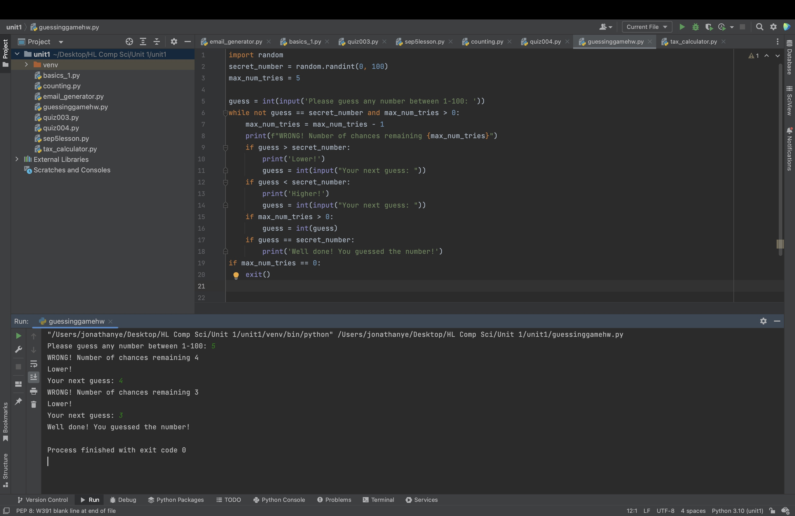

# While Statement Homework

## Guessing Game

Create a program for the Game “Guessing a number between 0 and 100” the computer is the player that knows the secret number. 
The user tries to guess the number by entering guesses, the computer indicates if the number is higher or lower than the secret number. 

The code:


```.py
import random
secret_number = random.randint(0, 100)
max_num_tries = 5

guess = int(input('Please guess any number between 1-100: '))
while not guess == secret_number and max_num_tries > 0:
    max_num_tries = max_num_tries - 1
    print(f"WRONG! Number of chances remaining {max_num_tries}")
    if guess > secret_number:
        print('Lower!')
        guess = int(input("Your next guess: "))
    if guess < secret_number:
        print('Higher!')
        guess = int(input("Your next guess: "))
    if max_num_tries > 0:
        guess = int(guess)
    if guess == secret_number:
        print('Well done! You guessed the number!')
if max_num_tries == 0:
    exit()
```





