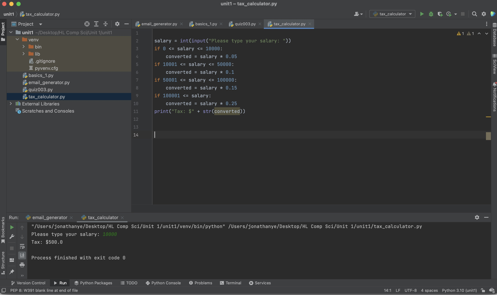

# Tax Calculator

```.py
salary = int(input("Please type your salary: "))
if 0 <= salary <= 10000:
    converted = salary * 0.05
if 10001 <= salary <= 50000:
    converted = salary * 0.1
if 50001 <= salary <= 100000:
    converted = salary * 0.15
if 100001 <= salary:
    converted = salary * 0.25
print("Tax: $" + str(converted))
```



