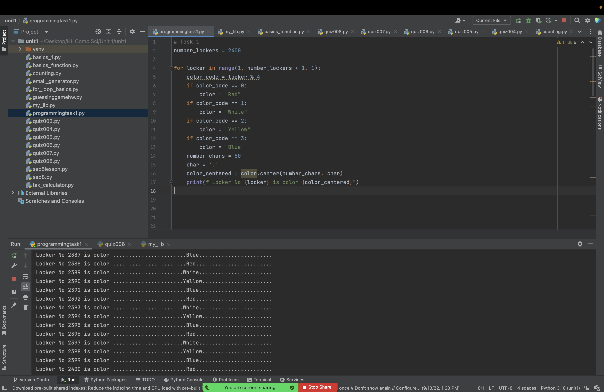
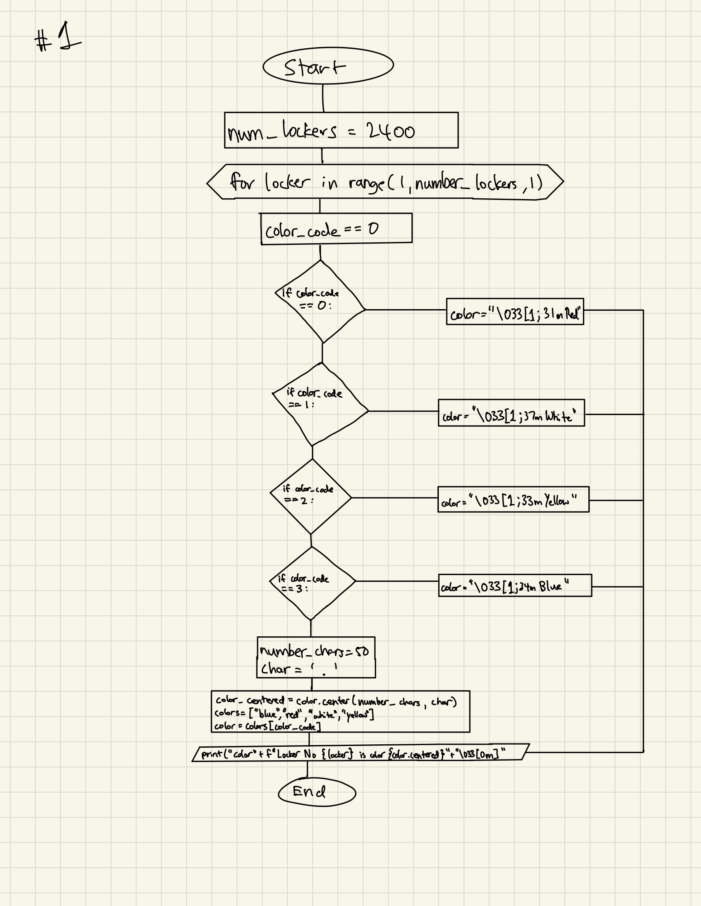

# Programming Task 1

## Task 1
Create a program and the flow diagram that shows the colors of all the lockers from 1 to 2400


```.py
number_lockers = 2400

for locker in range(1, number_lockers, 1):
    color_code = locker % 4
    if color_code == 0:
        color = "Red"
    if color_code == 1:
        color = "White"
    if color_code == 2:
        color = "Yellow"
    if color_code == 3:
        color = "Blue"
    number_chars = 50
    char = '.'
    color_centered = color.center(number_chars, char)
    colors = ["blue", "red", "white", "yellow"]
    color = colors[color_code]
    print(f"Locker No {locker} is color {color_centered}")
```





Flow chart:



