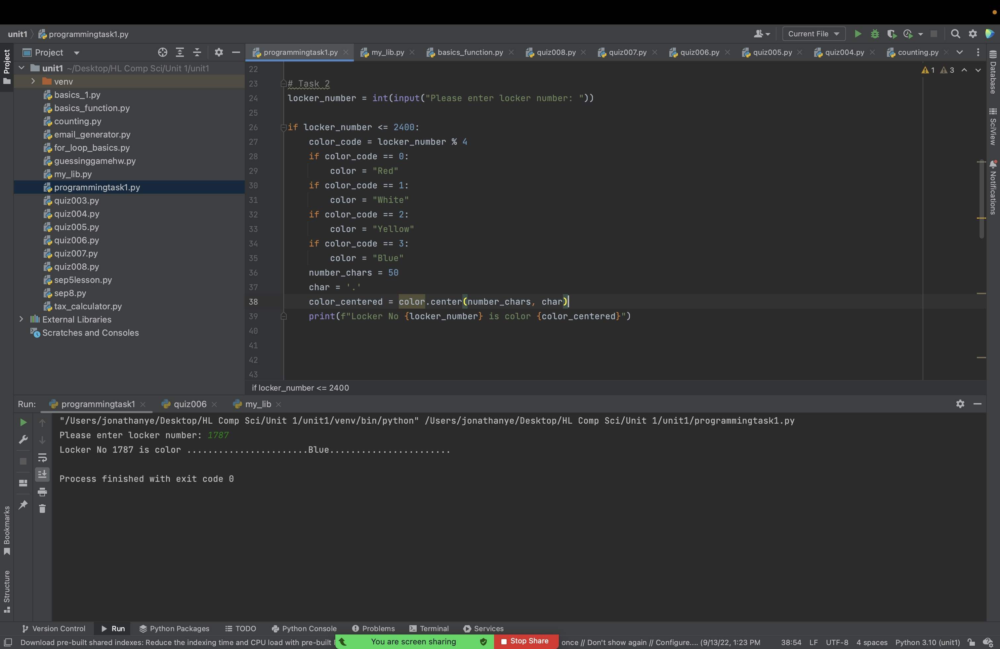
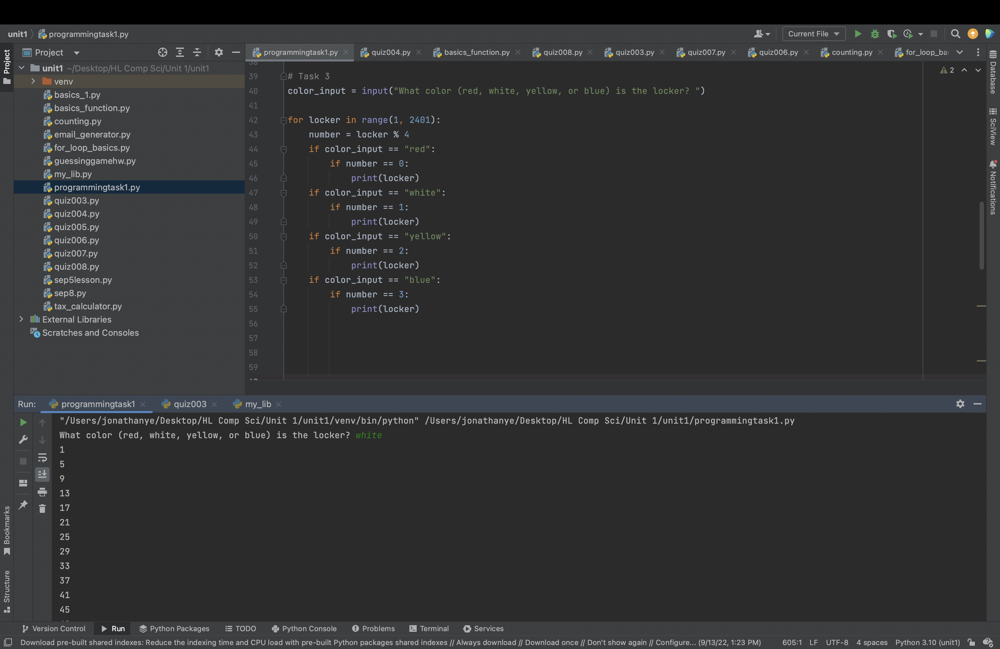
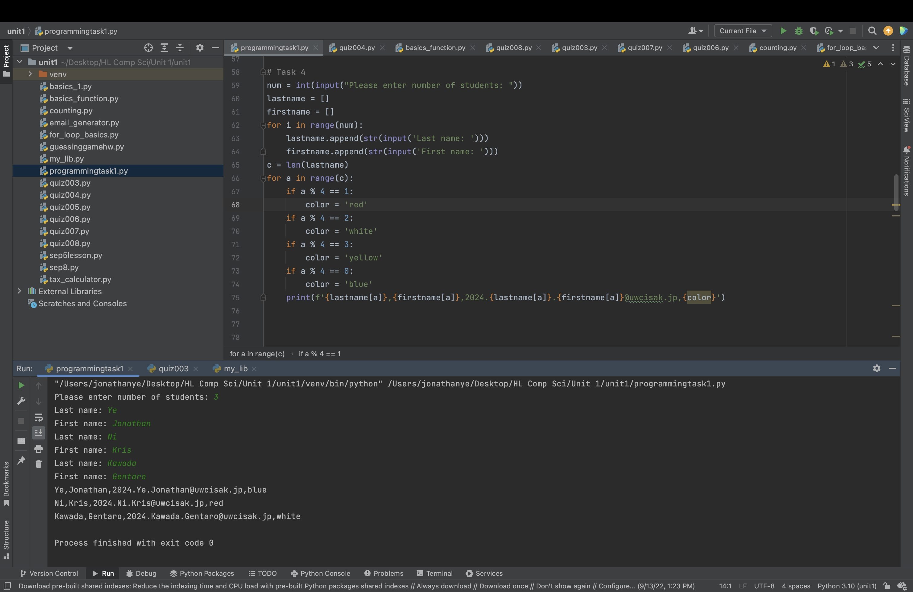

# Programming Task 1

## Task 1
Create a program and the flow diagram that shows the colors of all the lockers from 1 to 2400


```.py
number_lockers = 2400

for locker in range(1, number_lockers + 1, 1):
    color_code = locker % 4
    if color_code == 0:
        color = "Red"
    if color_code == 1:
        color = "White"
    if color_code == 2:
        color = "Yellow"
    if color_code == 3:
        color = "Blue"
    number_chars = 50
    char = '.'
    color_centered = color.center(number_chars, char)
    print(f"Locker No {locker} is color {color_centered}")
```


Flow chart:


## Task 2
Using the program above, create another program that allows the user to enter a number and the program outputs the color that should be used in the locker.


```.py
locker_number = int(input("Please enter locker number: "))

if locker_number <= 2400:
    color_code = locker_number % 4
    if color_code == 0:
        color = "Red"
    if color_code == 1:
        color = "White"
    if color_code == 2:
        color = "Yellow"
    if color_code == 3:
        color = "Blue"
    number_chars = 50
    char = '.'
    color_centered = color.center(number_chars, char)
    print(f"Locker No {locker_number} is color {color_centered}")
 ```
 
 
 
 
 
 ## Task 3
 Create a program that receives a color from the user, validates the input,  and outputs the numbers of the lockers of the color provided. 
 
 
 ```.py
 color_input = input("What color (red, white, yellow, or blue) is the locker? ")

for locker in range(1, 2401):
    number = locker % 4
    if color_input == "red":
        if number == 0:
            print(locker)
    if color_input == "white":
        if number == 1:
            print(locker)
    if color_input == "yellow":
        if number == 2:
            print(locker)
    if color_input == "blue":
        if number == 3:
            print(locker)
 ```
 
 
 
 
 
 ## Task 4
Given a list of names of students in the format lastname, firstname, create a program that assigns an email address and a locker to each student and saves the results in a file in the format lastname, firstname, email, locker 


```.py
num = int(input("Please enter number of students: "))
lastname = []
firstname = []
for i in range(num):
    lastname.append(str(input('Last name: ')))
    firstname.append(str(input('First name: ')))
c = len(lastname)
for a in range(c):
    if a % 4 == 1:
        color = 'red'
    if a % 4 == 2:
        color = 'white'
    if a % 4 == 3:
        color = 'yellow'
    if a % 4 == 0:
        color = 'blue'
    print(f'{lastname[a]},{firstname[a]},2024.{lastname[a]}.{firstname[a]}@uwcisak.jp,{color}')
```




