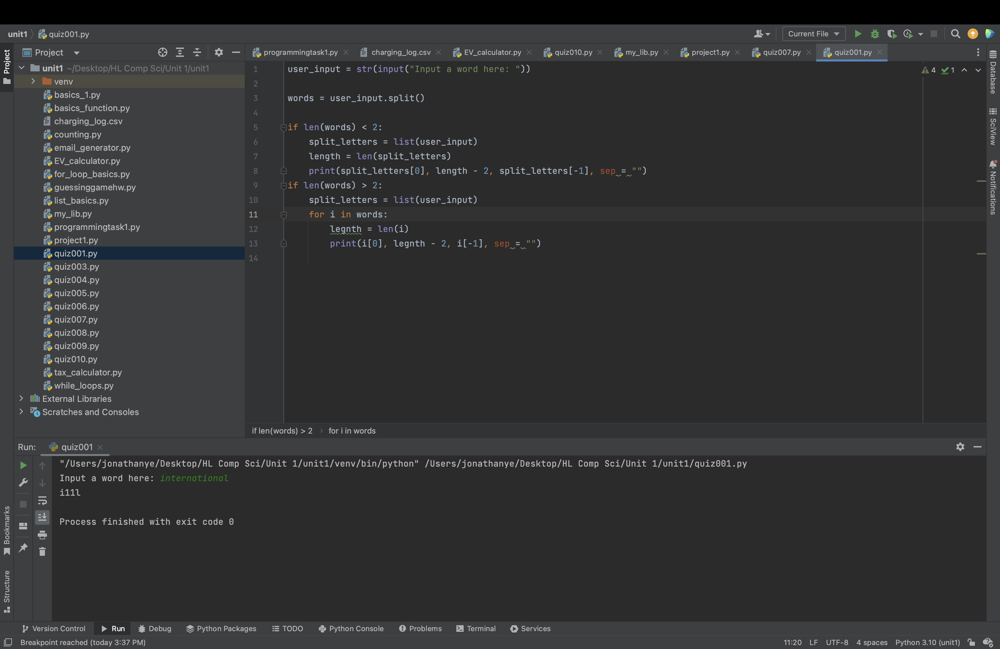
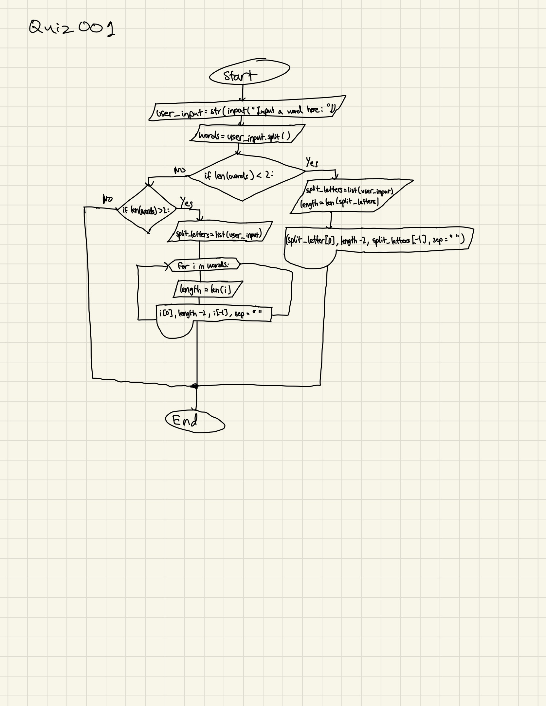
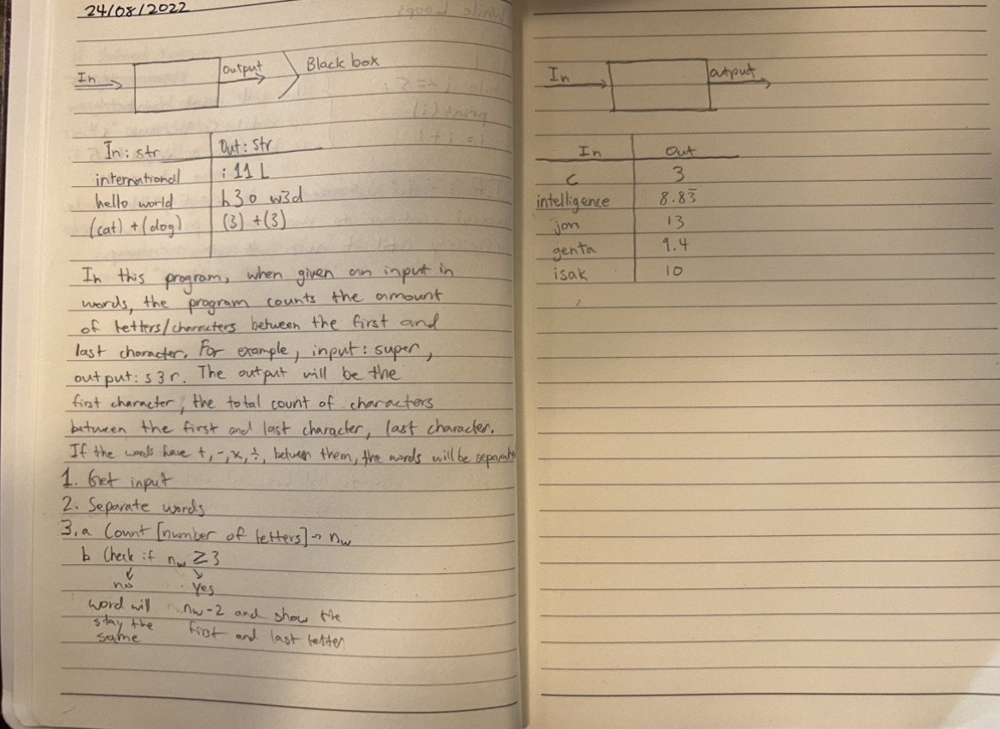

# Quiz 001

## Code
```.py
user_input = str(input("Input a word here: "))

words = user_input.split()

if len(words) < 2:
    split_letters = list(user_input)
    length = len(split_letters)
    print(split_letters[0], length - 2, split_letters[-1], sep = "")
if len(words) > 2:
    split_letters = list(user_input)
    for i in words:
        legnth = len(i)
        print(i[0], legnth - 2, i[-1], sep = "")
```





## Flow Chart





## Black Box

In Fig.1 I solved the quiz by creating the steps for the blackbox, and creating my own blackbox.
