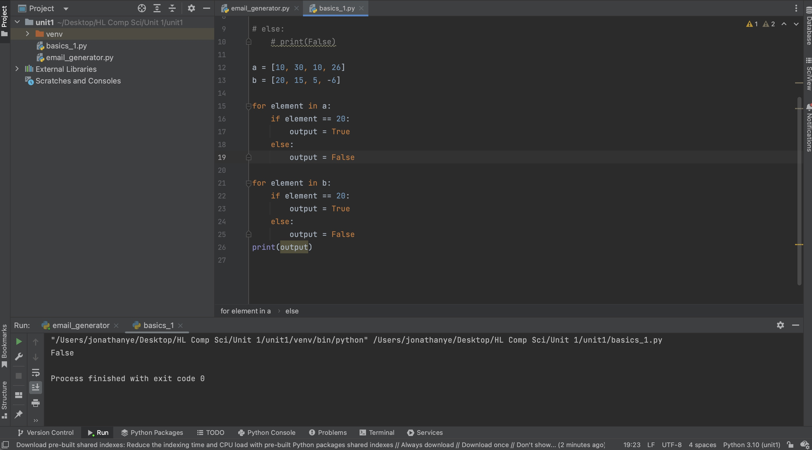
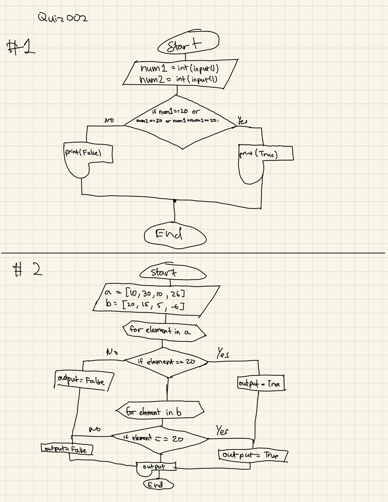

# Quiz 2
Given 2 numbers, A and B, Output TRUE if one of them is 20 or if their sum is 20.

## Quiz answer 1


```.py
num1 = int(input())
num2 = int(input())

if num1 == 20 or num2 == 20 or num1 + num2 == 20:
    print(True)

else:
    print(False)
```


## Quiz answer 2


```.py
a = [10, 30, 10, 26]
b = [20, 15, 5, -6]

for element in a:
    if element == 20:
        output = True
    else:
        output = False

for element in b:
    if element == 20:
        output = True
    else:
        output = False
print(output)
```





## Flow Chart:





