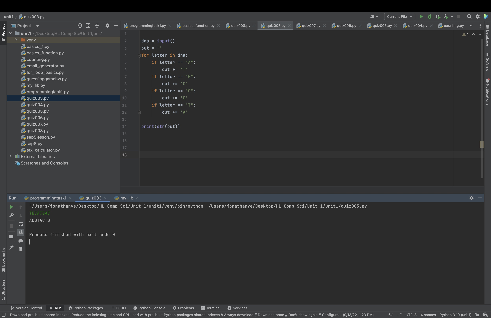

# Quiz 3

```.py
dna = input()
out = ''
for letter in dna:
    if letter == "A":
        out += 'T'
    if letter == "G":
        out += 'C'
    if letter == "C":
        out += 'G'
    if letter == "T":
        out += 'A'

print(str(out))
```



