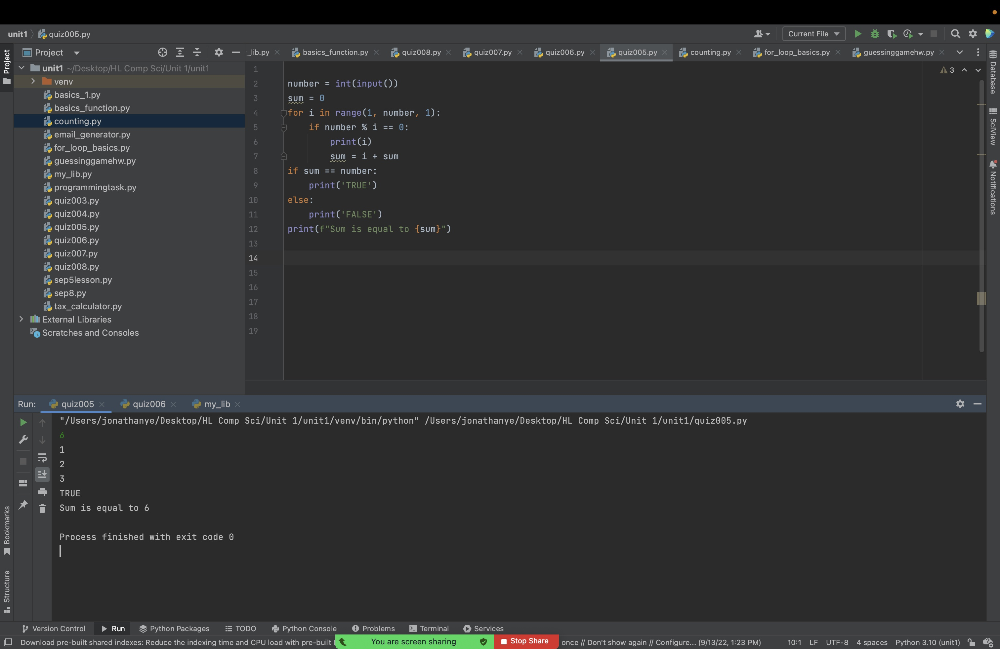

# Quiz 005

## Check if the number is a Perfect Number and show True or False


```.py
number = int(input())
sum = 0
for i in range(1, number, 1):
    if number % i == 0:
        print(i)
        sum = i + sum
if sum == number:
    print('TRUE')
else:
    print('FALSE')
print(f"Sum is equal to {sum}")
```





Flow Chart:

