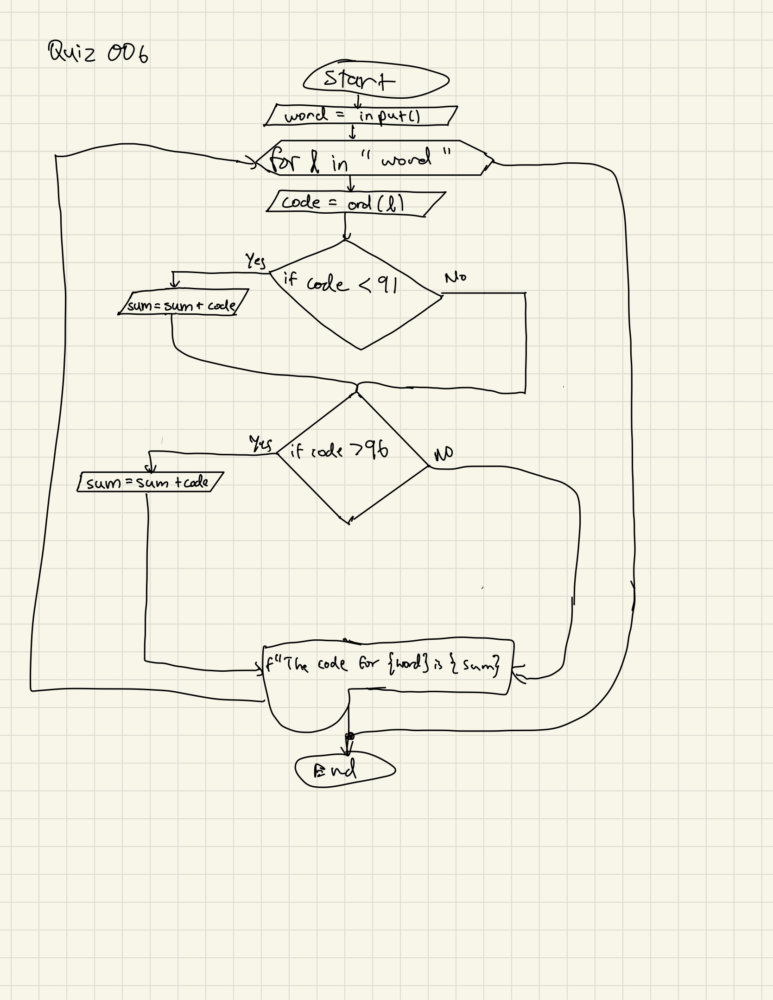

# Quiz 006
Given a string, creat a program that produces the sum of the characters in the string.

```.py
sum = 0
word = input("Input Word: ")
for l in word:
    code = ord(l)
    if code < 91:
        sum = sum + code
    if code > 96:
        sum = sum + code
print(f"The code for {word} is {sum}")
```


Flow Chart:



