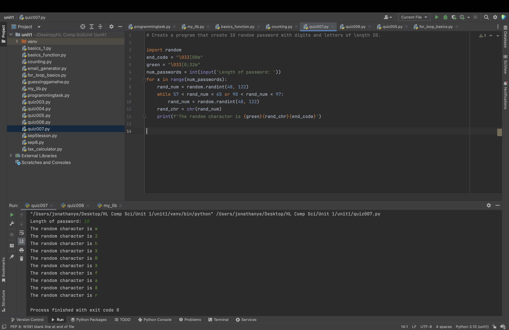
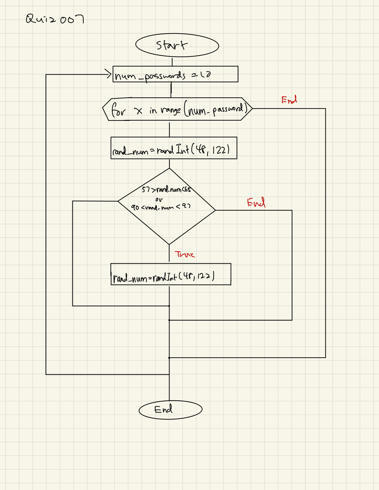

# Quiz 007

## Create a program that create 10 random password with digits and letters of length 20.


```.py
import random
end_code = "\033[00m"
green = "\033[0;32m"
num_passwords = int(input('Length of password: '))
for x in range(num_passwords):
    rand_num = random.randint(48, 122)
    while 57 < rand_num < 65 or 90 < rand_num < 97:
        rand_num = random.randint(48, 122)
    rand_chr = chr(rand_num)
    print(f'The random character is {green}{rand_chr}{end_code}')
```





Flow Chart:



