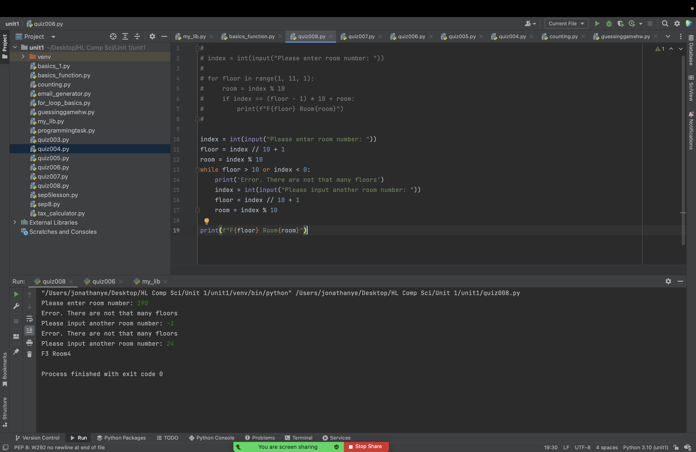

# Quiz008

## Create a program that will print the hotel floor and room number according to the room number (1 - 100)


```.py
index = int(input("Please enter room number: "))
floor = index // 10 + 1
room = index % 10
while floor > 10 or index < 0:
    print('Error. There are not that many floors')
    index = int(input("Please input another room number: "))
    floor = index // 10 + 1
    room = index % 10

print(f"F{floor} Room{room}")
```





Flow Chart:


