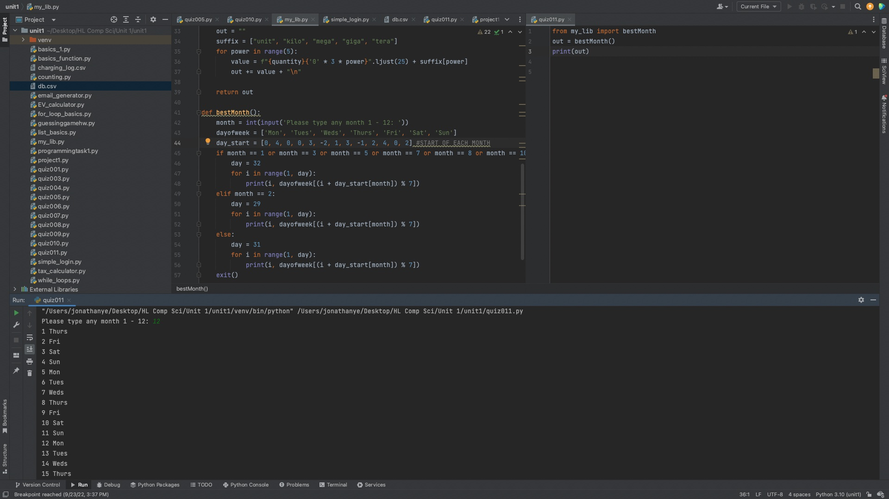

# Quiz 11
Create a function that shows the days of your birthday’s month for the year 2022. (HL) Users input any month.


```.py
# Code from my_lib
def bestMonth():
    month = int(input('Please type any month 1 - 12: '))
    dayofweek = ['Mon', 'Tues', 'Weds', 'Thurs', 'Fri', 'Sat', 'Sun']
    day_start = [0, 4, 0, 0, 3, -2, 1, 3, -1, 2, 4, 0, 2] #START OF EACH MONTH
    if month == 1 or month == 3 or month == 5 or month == 7 or month == 8 or month == 10 or month == 12:
        day = 32
        for i in range(1, day):
            print(i, dayofweek[(i + day_start[month]) % 7])
    elif month == 2:
        day = 29
        for i in range(1, day):
            print(i, dayofweek[(i + day_start[month]) % 7])
    else:
        day = 31
        for i in range(1, day):
            print(i, dayofweek[(i + day_start[month]) % 7])
    exit()
    
#------------------

from my_lib import bestMonth
out = bestMonth()
print(out)
```





## Flow Chart


