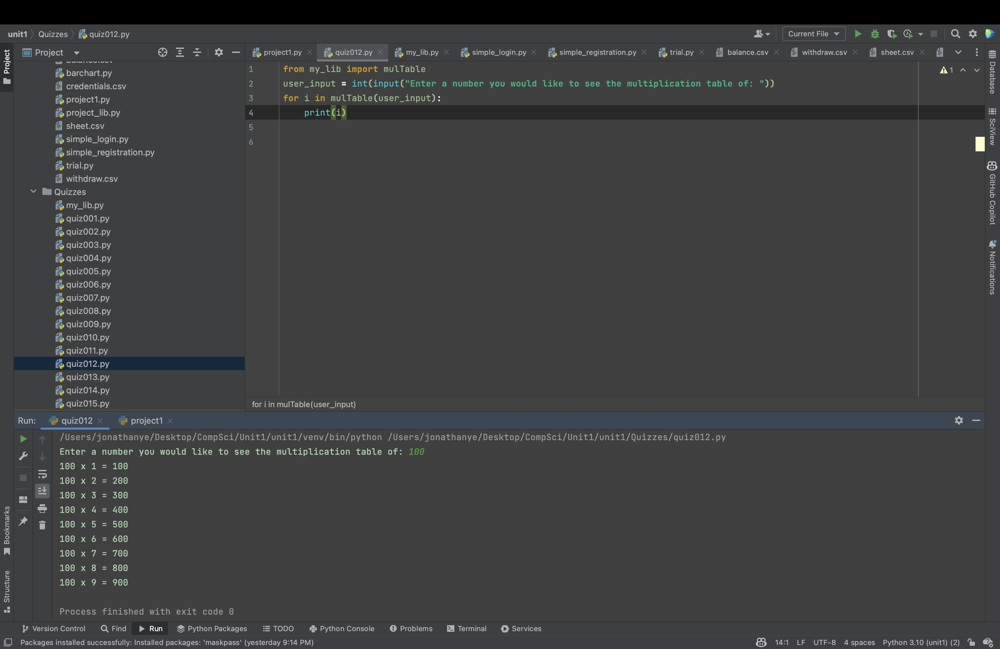
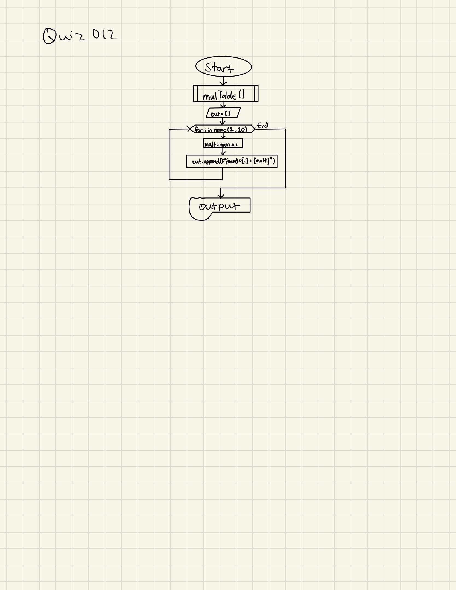

# Quiz 012
Create a function that receives integer 2<N<10, and returns the multiplication table for the number up to 9. 


```.py
def mulTable(num:int)->str:
    out = []
    for i in range(1, 10):
        mult = num * i
        out.append(f"{num} x {i} = {mult}")
    return out
```





## Flow chart:


