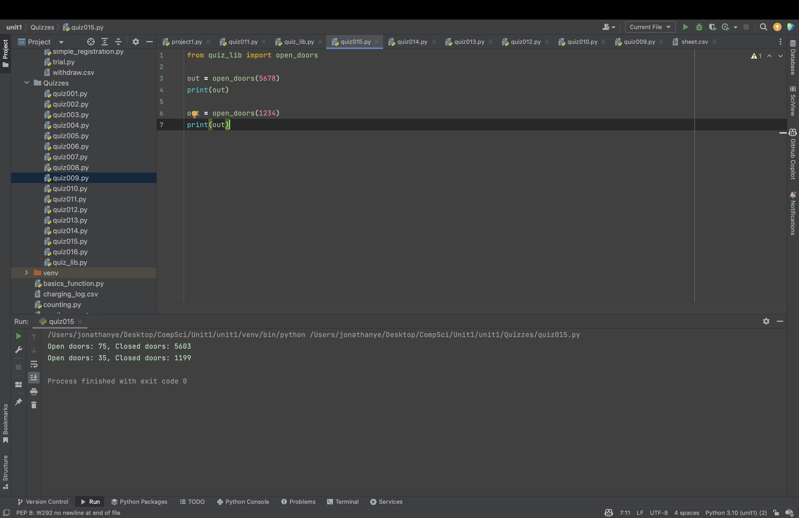

# Quiz 015
There are N closed doors in a school and N students present. The first student opens each door. The second student flips (open⇆close) every second door. The third student flips every third door, and so on. 
[SL]Create a function that shows the doors after 5 students.
[HL]Create a function that shows the doors open after N students.


```.py
def open_doors(num_students:int):
    doors = []
    for i in range(num_students):
        doors.append(False)
    for stu in range(1, num_students + 1):
        for door in range(1, num_students + 1):
            if door % stu == 0:
                doors[door - 1] = not doors[door - 1]
    open = 0
    closed = 0
    for fact in doors:
        if fact == True:
            open += 1
        else:
            closed += 1
    return f"Open doors: {open}, Closed doors: {closed}"
```



## Flow Chart:


