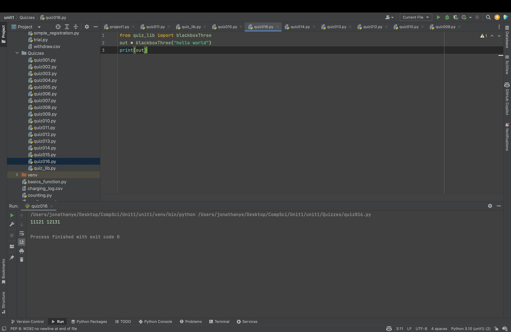
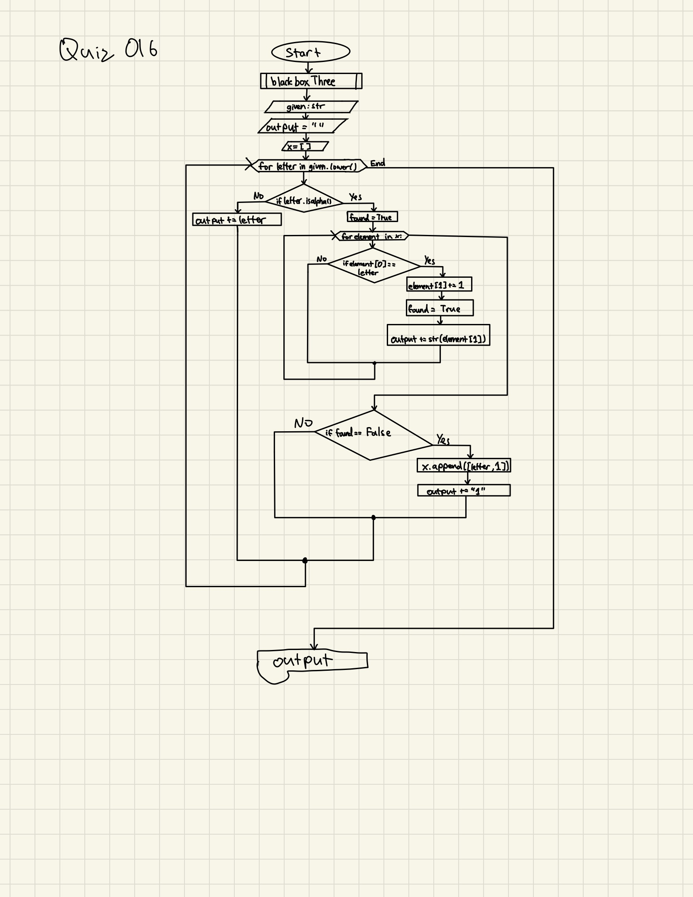

# Quiz 016
Create a function that produces the output given the input shown


```.py
def blackboxThree(given:str)->str:
    output = ""
    x = []
    for letter in given.lower():
        if letter.isalpha():
            found = False
            for element in x:
                if element[0] == letter:
                    element[1] += 1
                    found = True
                    output += str(element[1])
            if found == False: #new letter
                x.append([letter, 1])
                output += "1"
        else:
            output += letter
    return output
```




## Flow chart:


