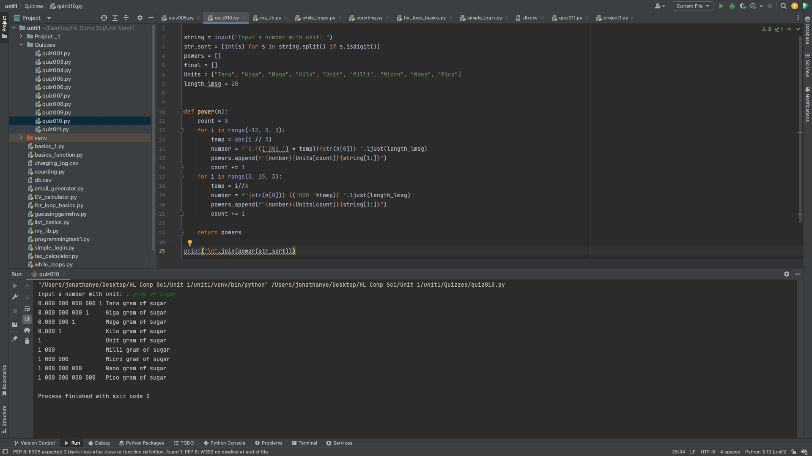
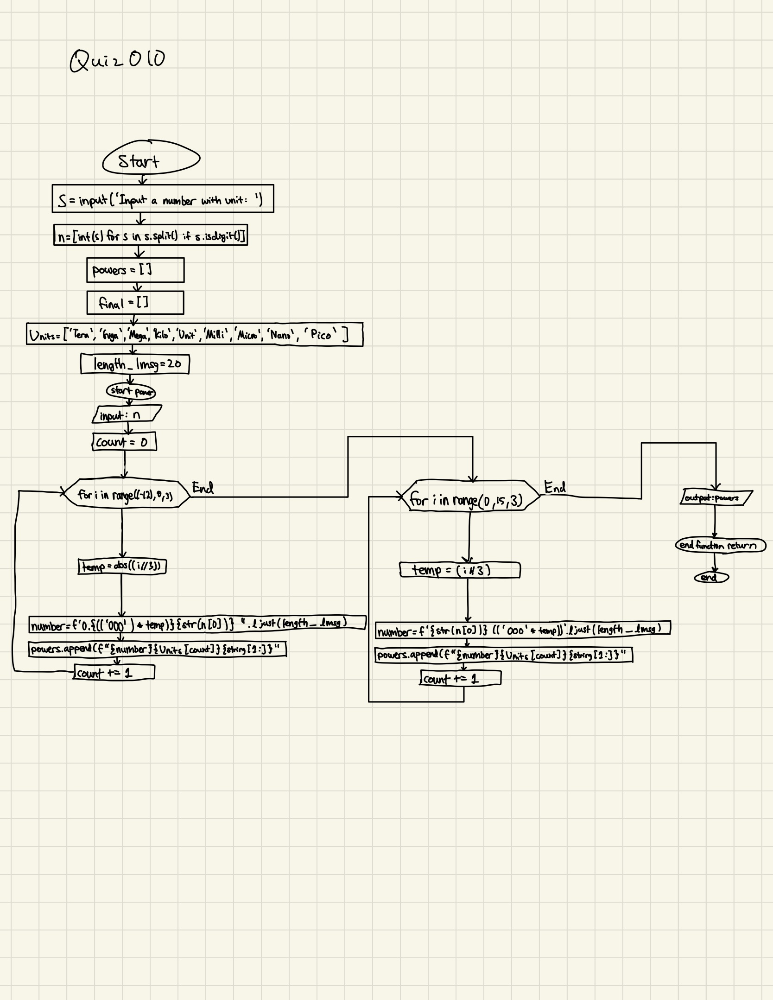

# Quiz 010
Create a function that produces the powers of ten from pico to tera for a number provided as an input parameter.
The function should return a list of the powers of ten. HL: User inputs number with units (e.g. 1 gram of salt)


```.py
string = input("Input a number with unit: ")
str_sort = [int(s) for s in string.split() if s.isdigit()]
powers = []
final = []
Units = ["Tera", "Giga", "Mega", "Kilo", "Unit", "Milli", "Micro", "Nano", "Pico"]
length_lmsg = 20


def power(n):
    count = 0
    for i in range(-12, 0, 3):
        temp = abs(i // 3)
        number = f"0.{(('000 ') * temp)}{str(n[0])} ".ljust(length_lmsg)
        powers.append(f"{number}{Units[count]}{string[1:]}")
        count += 1
    for i in range(0, 15, 3):
        temp = i//3
        number = f"{str(n[0])} {('000 '*temp)} ".ljust(length_lmsg)
        powers.append(f"{number}{Units[count]}{string[1:]}")
        count += 1

    return powers

print("\n".join(power(str_sort)))
```





## Flow chart:



