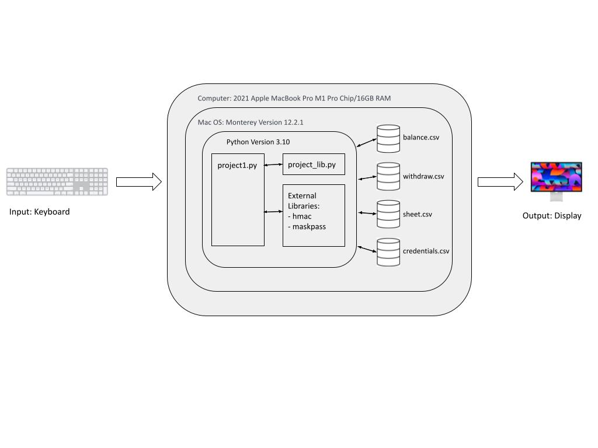

# Unit-1 Project: Crypto Wallet


<sub>Illustration: Wallet by Katie Horbal</sub>

# Criteria A: Planning

## Problem definition

Ms. Sato is a local trader who is interested in the emerging market of cryptocurrencies. She has started to buy and sell electronic currencies, however at the moment she is tracking all her transactions using a ledger in a spreadsheet which is starting to become burdensome and too disorganized. It is also difficult for Ms. Sato to find past transactions or important statistics about the currency. Ms. Sato is in need of a digital ledger that helps her track the amount of the cryptocurrency she in her balance, her transaction history, along with some useful statistics and information. Ms. Sato is currently interesting in the cryptocurrency Maker and wisehes to use it as her main cryptocurrency in the digital ledger. Maker (MKR) is a smart contract platform built on the Ethereum blockchain that aims to solve volatility issues for the crypto market. It is the basis for a new-generation blockchain-based banking system that allows for faster and simpler international payments and peer-to-peer transactions. Maker aims to unlock the potential of decentralized finance by building an inclusive platform for economic empowerment that gives everyone equal access to the global financial marketplace [1]. 

Apart for this requirements, Ms Sato is open to explore a cryptocurrency selected by the developer.

An example of the data store is:

| Date | Description | Category | Amount  |
|------|-------------|----------|---------|
| Sep 23 2022 | Purchased groceries | Food | 0.073 MKR |
| Sep 24 2022 | Purchased a new car | Expenses | 116.79 MKR |


## Success Criteria
1. The electronic ledger is a text-based software (Runs in the Terminal).
2. The electronic ledger display the basic description of the cyrptocurrency selected.
3. The electronic ledger allows to enter, withdraw and record transactions.
4. The electronic ledger can only be accessed by the client through a set and encrypted password.
5. The electronic ledger will display all past transactions.
6. The electronic ledger will show data about her expenses using a bar graph.


## Design Statement
I will to design and make a digital ledger for a client who is struggling to organize and keep track of her transaction history. The digital ledge will not only allow my client to keep track of her transactions, but allow her to be able to deposit and withdraw funds from her wallet, and also create new transactions. The Crypto Wallet will provide an easy and efficient way for her to deposit and withdraw funds and create transcations. Further, the digital ledger will include an organized and visually appealing spread sheet and bar graph displaying her transaction history. This digital ledger is constructed using the software Python and it will take about 35 hours to complete and will be evaluated according to the criteria given.


## Rationale for Proposed Solution
I will be programming this digital ledger for my client in Python. I decided to use Python because it is the most popular and widely used programming language and it is also among the fastest-growing programming languages in the tech industry [3]. Additionally, according to CodingNomads, 30% of developers wish to learn Python the most [4]. As a result of its widespread use, the program is easier for many developers to understand than languages like C or Javascript. This will benefit the digital ledger being programmed in Python because it makes it simple for upcoming programmers to comprehend the code and advance its development. There are also a wide range of libraries that are available in Python which can be easily accessed using a basic syntax [5]. Further, Python is a very efficient langauge that does not require the programmer to compile their program before executing it. Due to the fact that programmers do not have to invoke a compiler and run the compiler that helps turn source files into compiled class files, they can just simply run a ".py" file [6]. The digital ledger can be efficiently programmed in Python to meet all of my clients needs and resolve all the problems she is facing.


# Criteria B: Design

## System Diagram


Fig 1. System diagram for the program. It shows the input/outputs and software/hardware requirements. The diagram shows how the program runs on Python and shows the different databases the code exchanges information.

## Flow Diagrams


Fig 2. The flow diagram is for calculating the total balance the user has in their account according to their deposit and withdrawal history. The code will open and read both "balance.csv" and "withdraw.csv" files to see the data inside, and then calculate the difference to find the current balance and converted amount (USD).


Fig 3. The flow diagram is for calculating up all past transactions and printing them out onto an organized spreadsheet. The code will open up a file called "sheet.csv" which is where all the transaction data is stored and entered into. It will read the file and split the data into the three parts. The date, expense, and transaction amount.


Fig 4. The flow diagram is for displaying the bar graph with all the transaction totals. It calculates the total amount of money spend in each expense and displays them in an organized categorized bar graph.


## Test Plan
| Test Type | Target | Procedure | Expected Outcome |
|-----------|--------|-----------|------------------|
| Functional: Unit testing | validate_int_input | 1. Use the function validate_int_input 2. Enter a letter in the terminal 3. Enter a number in the terminal | 1. With a letter an error message will be print 2. With a number the program will exit. |
| Functional: Integrational testing | Register system | 1. Use the function register. 2. Enter a desired username and password in the terminal | After entering a desired username and password, the crendtials should go into a database file to store the credentials. It should also print "Registeration Successful!" after the username and password is entered.
| Functional: Integrational testing | Login system | 1. Use the function login. 2. Enter your credentials (username and password) in the terminal | If the username and passwords match with the credentials stored in the database file from the registrations, the code should continue by printing, "Welcome to your Crypto Wallet (username)!". If the username and password entered does not match any of the crendentials stored in the database file, access will be denied to the user and the program will close. 
| Functional : Integrational testing | Create a transaction | 1. Choose to create a transaction 2. Enter the date: Input day, month, year 3. Enter expense category 4. Enter expense amount, price 5. Choose to view transaction history | After choosing the option to create a transaction, the user should be given the ability to choose what the expense was (5 options: Food, Daily, Rent, Travel, Other). Then the user should be given the ability to input a day, month, and year of when the transaction occured. Finally, they can input how much the expense was. All this data should be stored into the database file named "sheet.csv" where all transaction data is organized, so when the user chooses to view their transaction history, they can see a spreadsheet and bar graph of all their transactions. |
| Non-functional: Load testing | Testing if the spreadsheet and bar graph in the transaction history shows all data without any glitches or bugs and does not take a long time to laod. Additionally, all newly inputted transaction data should be displayed well. | 1. Login to the Crypto Wallet 2. Select Create or View Transaction History option 3. Select View transaction history | All information in the spreadsheet should be appropriate to which column it falls under and all information in the bar graph should be appropiate to which row it belongs to. Furthermore, any new transactions the user inputted should be added to the spreadsheet and bar graph. |
| Non-functional: Usuability testing | The login instructions and options displayed in main menu after logging in are clear and easy to read and the directions are easy to follow | 1. Run program 2. Login | The login instructions are clearly displayed, and the main menu items can be easily read, and directions are simple and easy to follow. | 
| Non-functional: Response time | Testing if code responds quickly to user input | 1. Login to the Crypto Wallet 2. Choose any options and follow the prompted directions that follow | The code runs smoothly without crashing or severe lag. The program responds promptly to user input and displays accurate information. | 

## Record of Tasks
| Task No | Planned Action | Planned Outcome | Time estimate | Target completion date | Criterion |
|---------|----------------|-----------------|---------------|------------------------|-----------|
| 1 | Meet withe the client | Talk with the client to dicuss the problems they are facing and brainstorm solutions to create a plan to help the client resolve the problems| 10 minutes | Sep 23 | A |
| 2 | Brainstorm and write the problem definition	| A clear problem definition on Github	| 15 minutes | Sep 23 | A |
| 3 | Brainstorm and write down success criterias | A clear success criteria that suits the client and resolves the problem | 15 minutes | Sep 23 | A |
| 4 | Brainstorm and write down a proposed solution for the client| A clear justification that suits the client and developer.| 15 minutes | Sep 23 | A |
| 5 | Create system diagram | To have a clear idea of the hardware and software requirements for the proposed solution | 45 minutes | Sep 23| B | 
| 6 | Create a simple registration and login system | To create a program that allows the user to register and login to their digital ledger using a username and password they set up | 1 hour minutes| Sep 26| C | 
| 7 | Encrypt the password | A program to protect the application using a password with encryption | 45 minutes | Sep 28 | C |
| 8 | Code the menu of the Crypto Wallet | To have a menu system that includes the title and menu items on the screen | 20 minutes | Sep 30 | C |
| 9 | Code menu options and allow user interaction | The user can choose different options from the menu (Ex: Option 1: Record transcation, and the user will be able to choose Option 1 to record a transaction). | 2 hours | Oct 1 | C | 
| 10 | Create visual display of expense data | Code a bar graph that includes all expense history in categories. | 20 minutes | Oct 1 | C |
| 11 | Create a visual display for transaction data | Code a chart that includes all transaction data with the date, expense, and amount. | 45 minutes | Oct 2 | C |
| 12 | Code a menu for deposit and withdraw | Code a second menu that gives the user two options: Deposit and Withdraw. | 15 minutes | Oct 2 | C |
| 13 | Display correct balance after money is either deposited or withdrawn | Code a function that would add or subtract the amount of money deposited or withdrawn from the balance and print the updated balance | 1 hour | Oct 3 | C |
| 14 | Code a menu for creating or viewing transactions | Code a second menu that gives the user two options: Create a transaction, View transaction history. | 15 minutes | Oct 4 | C |
| 15 | Code transaction functions | Create a code that allows the user to record when they made the transaction, what kind of transaction it was, and how much the transaction was. The code will then transfer all of that information into a spreadsheet and bar graph, with accurate data | 1 hour | Oct 4 | C |
| 16 | Make sure to validate user input for all option choices | Code functions that would make sure what the user inputs follows the requirements (Ex: If a number digit is required but user enters a character, an error message will print, and allowing them to retry). | 1 hour 30 minutes | Oct 5 | C | 
| 17 | Hide the password when it is being typed | The user will only see asteriks when entering their password to increase security. | 45 minutes | Oct 5 | C |
| 18 | Draw and describe the flow diagrams | Flow diagrams for different parts of the solution along with a brief explanation | 1 hour | Oct 6 | B |
| 19 | Write the test plans | Procedures one should take to test the program and the expected outcome of each test is on Github | 1 hour | Oct 7 | B |
| 20 | Meet with client | Hear feedback from the client about the current state of the product | 30 minutes | Oct 7 | B | 
| 21 | Finish Criteria C | Write the descriptions of the code and the detail of the techniques that were used on Github | 2 hours | Oct 7 | C |

# Criteria C: Development

## Techniques Use:
1. Functions
2. For/while loops
3. Input Validation
4. If statements
5. Encryption

## User registration

```.py
def register(uname:str, password:str):
    '''
    This function saves a user, password in the file
    credentials.csv
    :param uname: username a string
    :param password: password a string
    :return: nothing
    '''
    #open the file in mode append: a
    file = open("credentials.csv", "a")
    salty = "¯\(°_O)/¯"
    to_hash = uname + password + salty
    hashed_password = hmac.new(''.encode(), to_hash.encode(), 'sha512').hexdigest()
    file.write(f"{uname},{hashed_password}\n")
```

The first part of creating a digital ledger for a client is to create a registration system so the client can create a Crypto Wallet account. This code allows the user to enter a username and password they desire, and it adds their crendentials into a file with and encrypted password. The encryption I used in this is called "hashing". Encryption is the process of encoding plain text or any information in such a way that only authorized people can read it with a corresponding key, like a password, so that confidential data can be protected from unauthorized persons. Hashing converts any amount of data into a fixed-length hash that cannot be reversed. In my code, it is hashed using a random string of characters, known as a salt. This is an additional input to my code above to hash the user's password.


## Create or view transaction history

```.py
if option == 3:
    cvmenu = '''1. Create a transaction
2. View transaction history'''
    print(cvmenu)

    cvmenu = validate_int_input('Please enter an option [1-2]: ')
    while cvmenu > 2 or cvmenu < 1:
        cvmenu = validate_int_input(f"{colors[1]}Invalid option. Please enter an option [1-2]: {end_code}")
```

Above is the code that allows the user to choose between creating a new transaction or viewing their transaction history. Using the "if" statement, the user will be directed to either creating a new transaction, or to their transaction history. This is one of the main solutions to the clients problem, and it will allow her to easily store and see her transaction data.


## Create transaction

```.py
expensemenu = '''Please choose what type of expense your transaction is:
1. Food
2. Daily
3. Rent
4. Travel
5. Other'''

print(expensemenu)
expensemenu = validate_int_input('Please enter an option [1-5]: ')
while expensemenu > 5 or expensemenu < 1:
    expensemenu = validate_int_input(f"{colors[1]}Invalid option. Please enter an option [1-5]: {end_code}")
cats = ["Food", "Daily", "Rent", "Travel", "Other"]
if expensemenu in [1,2,3,4,5]:
    with open("sheet.csv", "a") as file:
        MM = validate_int_input("Please enter the month of your transaction (ex. 01 - 12): ")
        while not 0 < MM < 13:
            print(f"{colors[1]}Invalid month.{end_code}")
            MM = validate_int_input(f'Please enter the month you made this transaction (ex. 01 - 12): ')
        DD = validate_int_input("Please enter the day of your transaction (ex. 01 - 31): ")
        while not 0 < DD < 32:
            print(f"{colors[1]}Invalid day.{end_code}")
            DD = validate_int_input(f'Please enter the day you made this transaction (ex. 01 - 31): ')
        YYYY = validate_int_input("Please enter the year of your transaction (ex. 2021): ")
        while not 2000 < YYYY < 2023:
            print(f"{colors[1]}Invalid year.{end_code}")
            YYYY = validate_int_input(f'Please enter the year you made this transaction (ex. 2021): ')
        date = f'{MM}/{DD}/{YYYY}'
        cost = validate_int_input('Please type the cost of this transaction: ex. 10: ')
        transaction = f"{date},{cats[expensemenu-1]},{cost}"
        file.write(f'{transaction}\n')
    print(f"{colors[2]}{fonts[0]}You have created a transaction for {cost}MKR for {cats[expensemenu - 1]} on {date}.{end_code}")
```

This is the code that allows the user to create a transaction. It first verifies an option the user inputs, 1-5, which defines each expense category. Then based off of the option, the transaction will be created under that category. The code asks for the expense type, date, and cost. To prevent user error, the data is verified by section. After all the data is gathered, it is neatly compiled and added into the database file "sheet.csv". I tried to make this as simple as possible by keeping it short. The client will only need to enter three different pieces of information. By validating each of the users input, it makes the information much easier to orangize. Instead of having to take out each number or word out from the inputs, it is easily organized and put into categories.


## Transaction history spreadsheet

```.py
with open("sheet.csv", "r") as file:
    sheet = file.readlines()
    print('Transaction history:')
    print('-' * 60)
    print('|  Date(MM/DD/YYYY)  |  Expense  | Transaction amount (MKR)|')
    print('-' * 60)


food = 0
daily = 0
rent = 0
travel = 0
other = 0
for l in sheet:
    l = l.strip()
    line1 = l.split(",")
    date = line1[0]
    cat = line1[1]
    price = line1[2]
    print(f'|{date.center(20, " ")}|{cat.center(11, " ")}|{price.center(25, " ")}|')
    print('-' * 60)
```

The code above prints out the users recorded transactions into an organized spreadsheet. This will allow the client to easliy see all of their past transaction data. It is simple and visually appealing. It is able to print all recent transactions created by the user by using a for loop. With the for loop, it will continue to go through the data in the "sheet.csv" file and print the data into an organized spreadsheet with all the data in the appropiate column until there is no more data to print. It makes sure each piece of information is placed in the correct column to prevent disorganization.


## Transaction history bar graph 

```.py
# Adding up the prices
if cat.lower() in "food":
    food += int(price)

elif cat.lower() in "daily":
    daily += int(price)

elif cat.lower() in "rent":
    rent += int(price)

elif cat.lower() in "travel":
    travel += int(price)

else:
    other += int(price)

# Bar graph of expenses
data = [
    ('Food', food),
    ('Daily', daily),
    ('Rent', rent),
    ('Travel', travel),
    ('Other', other),
]

max_value = max(count for _, count in data)
increment = max_value / 25

longest_label_length = max(len(label) for label, _ in data)

for label, count in data:

    bar_chunks, remainder = divmod(int(count * 8 / increment), 8)
    bar = '█' * bar_chunks

    if remainder > 0:
        bar += chr(ord('█') + (8 - remainder))

    bar = bar or '▏'

    print(f'{colors[7]}{label.rjust(longest_label_length)} ▏ {count:#4d} {bar}{end_code}')
```

Since my client had trouble keeping track of all of their past transactions, I thought a bar graph would be a nice addition to the spreadsheet. The code above prints out the users recorded transactions into an organized bar graph that displays the total spendings. The bar graph code follows the code from the spreadsheet, taking the same data from the file "sheet.csv". It finds the category of expense using "if" and "elif" statements. It groups up all of the numbers into the given categories, and then adds them up accordingly. The bar graph is produced using the number data gathered with a for loop. It prints out each category in a different row, and the displays the bar based off of the total prices added up. The larger the total, the longer the bar will be and vice versa. The bar graph is visually appealing and it will allow my client to see how much money she has used on certain things and compare her spendings. The bar graph is a good way help my client keep her transacitions organized.


## Video of the Program
[Video of the Program](https://drive.google.com/file/d/1ZUzw6oEtKnRyDeC0dIOOwuSIvULnd2qX/view?usp=sharing)

# Citations
1. Maker (MKR) Price, Charts, and News - Coinbase. Retrieved September 23, 2022
2. Abra. “Maker.” Abra, 12 Apr. 2022. Retrieved September 23, 2022
3. Sanyal, Sayantani. 10 Reasons Why Python Is One Of The Best Programming Languages. Retrieved September 24, 2022
4. Why learn python? 6 reasons why it's so hot right now. CodingNomads, 2022, January 19. Retrieved September 24, 2022 
5. Advantages and disadvantages of python - how it is dominating Programming World. DataFlair. Retrieved September 24, 2022
6. Vilmate. “Advantages of Python over Other Programming Languages.” VILMATE, 3 Oct. 2022. Retrieved September 24, 2022
7. “How to Hash Passwords in Python.” GeeksforGeeks, 22 June 2022. Retrieved September 28, 2022
8. “Drawing Ascii Bar Charts.” Drawing ASCII Bar Charts. Retrieved October 1, 2022
