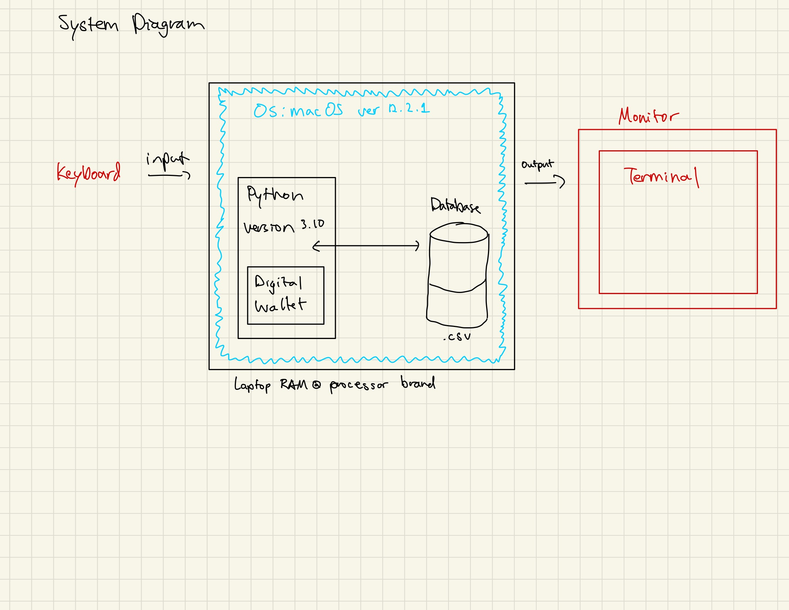

# Unit-1 Project: Crypto Wallet

  
Illustration for Glenn Harvey

# Criteria A: Planning

## Problem definition

Ms. Sato is a local trader who is interested in the emerging market of cryptocurrencies. She has started to buy and sell electronic currencies, however at the moment she is tracking all her transactions using a ledger in a spreadsheet which is starting to become burdensome and too disorganized. It is also difficult for Ms. Sato to find past transactions or important statistics about the currency. Ms Sato is in need of a digital ledger that helps her track the amount of the cryptocurrency, the transactions, along with useful statistics. 

Apart for this requirements, Ms Sato is open to explore a cryptocurrency selected by the developer.

An example of the data store is:

| Date | Description | Category | Amount  |
|------|-------------|----------|---------|
| Sep 23 2022 | Purchased groceries | Food | 0.073 MKR |
| Sep 24 2022 | Purchased a new car | Expenses | 116.79 MKR |

## Proposed Solution

Design statement:
I will to design and make a digital ledger for a client who is struggling to keep track of her transaction history and important statistics about the cryptocurrency she is investing in. The Crypto Wallet will provide an easy and efficient way for her to keep track of her transcations and is constructed using the software Python. It will take about 35 hours to make and will be evaluated according to the criteria given.

Maker (MKR) is a smart contract platform built on the Ethereum blockchain that aims to solve volatility issues for the crypto market. It is the basis for a new-generation blockchain-based banking system that allows for faster and simpler international payments and peer-to-peer transactions. Maker aims to unlock the potential of decentralized finance by building an inclusive platform for economic empowerment that gives everyone equal access to the global financial marketplace.

Citations: 
https://www.coinbase.com/price/maker
https://www.abra.com/cryptocurrency/maker/#:~:text=What%20is%20Maker%20coin%3F,peer%2Dto%2Dpeer%20transactions.

Justify the tools/structure of your solution

## Success Criteria
1. The electronic ledger is a text-based software (Runs in the Terminal).
2. The electronic ledger display the basic description of the cyrptocurrency selected.
3. The electronic ledger allows to enter, withdraw and record transactions.
4. The electronic ledger can only be accessed by the client through a set password.
5. The electronic ledger will display all past transactions.
6. The electronic ledger will show data about her expenses using a bar graph: Each color represents a certain expense.

# Criteria B: Design

## System Diagram

Fig 1. System diagram for the digital wallet, showing input/outputs and requirements, hardware/sopftware

## Flow Diagrams

## Test Plan
| Test Type | Target | Procedure | Expected Outcome |
|-----------|--------|-----------|------------------|
| Unit testing | validate_int_input | 1. Use the function validate_int_input 2. Enter a letter in the terminal 3. Enter a number in the terminal | 1. With a letter an error message will be print 2. With a number the program will exit. |
## Record of Tasks
| Task No | Planned Action | Planned Outcome | Time estimate | Target completion date | Criterion |
|---------|----------------|-----------------|---------------|------------------------|-----------|
| 1 | Meet withe the client | Talk with the client to dicuss the problems they are facing and brainstorm solutions to create a plan to help the client resolve the problems| 10 minutes | Sep 23 | A |
| 2 | Create system diagram | To have a clear idea of the hardware and software requirements for the proposed solution | 10 minutes | Sep 23| B | 
| 3 | Create a simple registration and login system | To create a program that allows the user to register and login to their digital ledger using a username and password they set up | 1 hour minutes| Sep 26| C | 
| 4 | Encrypt the password | A program to protect the application using a password with encryption | 45 minutes | Sep 28 | C |
| 5 | Code the menu of the Crypto Wallet | To have a menu system that includes the title and menu items on the screen | 20 minutes | Sep 30 | C |
| 6 | Code menu options and allow user interaction | The user can choose different options from the menu (Ex: Option 1: Record transcation, and the user will be able to choose Option 1 to record a transaction). | 2 hours | Oct 1 | C | 
| 7 | Create visual display of expense data | Code a bar graph that includes all expense history in categories. | 20 minutes | Oct 1 | C |
| 8 | Create a visual display for transaction data | Code a chart that includes all transaction data with the date, expense, and amount. | 45 minutes | Oct 2 | C |
| 9 | Code a menu for deposit and withdraw | Code a second menu that gives the user two options: Deposit and Withdraw. | 15 minutes | Oct 2 | C |
| 10 | Display correct balance after money is either deposited or withdrawn | Code a function that would add or subtract the amount of money deposited or withdrawn from the balance and print the updated balance | 1 hour | Oct 3 | C |
| 11 | Code a menu for creating or viewing transactions | Code a second menu that gives the user two options: Create a transaction, View transaction history. | 15 minutes | Oct 4 | C |
| 12 | Code transaction functions | Create a code that allows the user to record when they made the transaction, what kind of transaction it was, and how much the transaction was. The code will then transfer all of that information into a spreadsheet and bar graph, with accurate data | 1 hour | Oct 4 | C |
