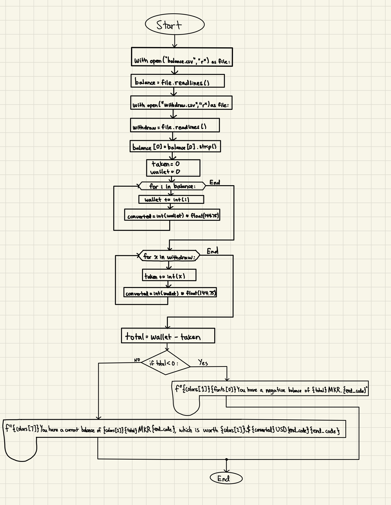
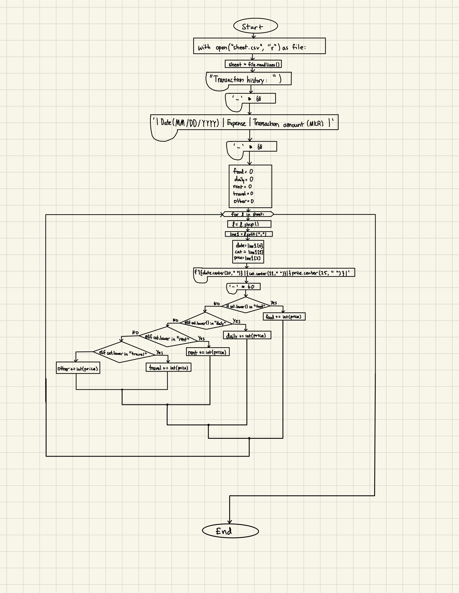

# Unit-1 Project: Crypto Wallet

  
<sub>Illustration for Glenn Harvey</sub>

# Criteria A: Planning

## Problem definition

Ms. Sato is a local trader who is interested in the emerging market of cryptocurrencies. She has started to buy and sell electronic currencies, however at the moment she is tracking all her transactions using a ledger in a spreadsheet which is starting to become burdensome and too disorganized. It is also difficult for Ms. Sato to find past transactions or important statistics about the currency. Ms Sato is in need of a digital ledger that helps her track the amount of the cryptocurrency, the transactions, along with useful statistics. 

Apart for this requirements, Ms Sato is open to explore a cryptocurrency selected by the developer.

An example of the data store is:

| Date | Description | Category | Amount  |
|------|-------------|----------|---------|
| Sep 23 2022 | Purchased groceries | Food | 0.073 MKR |
| Sep 24 2022 | Purchased a new car | Expenses | 116.79 MKR |

## Proposed Solution

Design statement:
I will to design and make a digital ledger for a client who is struggling to keep track of her transaction history. The digital ledge will not only allow my client to keep track of her transactions, she will be able to deposit and withdraw funds from her wallet, and also create new transactions. The Crypto Wallet will provide an easy and efficient way for her to deposit and withdraw funds and create transcations. Further, the digital ledger includes an organized and visually appealing sheet and bar graph displaying the transaction history. This digital ledger is constructed using the software Python and it will take about 35 hours to complete and will be evaluated according to the criteria given.

Maker (MKR) is a smart contract platform built on the Ethereum blockchain that aims to solve volatility issues for the crypto market. It is the basis for a new-generation blockchain-based banking system that allows for faster and simpler international payments and peer-to-peer transactions. Maker aims to unlock the potential of decentralized finance by building an inclusive platform for economic empowerment that gives everyone equal access to the global financial marketplace.

Citations: 
https://www.coinbase.com/price/maker
https://www.abra.com/cryptocurrency/maker/#:~:text=What%20is%20Maker%20coin%3F,peer%2Dto%2Dpeer%20transactions.

Justify the tools/structure of your solution

## Success Criteria
1. The electronic ledger is a text-based software (Runs in the Terminal).
2. The electronic ledger display the basic description of the cyrptocurrency selected.
3. The electronic ledger allows to enter, withdraw and record transactions.
4. The electronic ledger can only be accessed by the client through a set and encrypted password.
5. The electronic ledger will display all past transactions.
6. The electronic ledger will show data about her expenses using a bar graph.

# Criteria B: Design

## System Diagram


Fig 1. System diagram for the program. It shows the input/outputs and software/hardware requirements. The diagram shows how the program runs on Python and shows the different databases the code exchanges information.

## Flow Diagrams


Fig 2. The flow diagram is for calculating the total balance the user has in their account according to their deposit and withdrawal history. The code will open and read both "balance.csv" and "withdraw.csv" files to see the data inside, and then calculate the difference to find the current balance and converted amount (USD).


Fig 3. The flow diagram is for calculating up all past transactions and printing them out onto an organized spreadsheet. The code will open up a file called "sheet.csv" which is where all the transaction data is stored and entered into. It will read the file and split the data into the three parts. The date, expense, and transaction amount.


Fig 4. The flow diagram is for displaying the bar graph with all the transaction totals. It calculates the total amount of money spend in each expense and displays them in an organized categorized bar graph.


## Test Plan
| Test Type | Target | Procedure | Expected Outcome |
|-----------|--------|-----------|------------------|
| Unit testing | validate_int_input | 1. Use the function validate_int_input 2. Enter a letter in the terminal 3. Enter a number in the terminal | 1. With a letter an error message will be print 2. With a number the program will exit. |
## Record of Tasks
| Task No | Planned Action | Planned Outcome | Time estimate | Target completion date | Criterion |
|---------|----------------|-----------------|---------------|------------------------|-----------|
| 1 | Meet withe the client | Talk with the client to dicuss the problems they are facing and brainstorm solutions to create a plan to help the client resolve the problems| 10 minutes | Sep 23 | A |
| 2 | Brainstorm and write the problem definition	| A clear problem definition on Github	| 15 minutes | Sep 23 | A |
| 3 | Brainstorm and write down success criterias | A clear success criteria that suits the client and resolves the problem | 15 minutes | Sep 23 | A |
| 4 | Brainstorm and write down a proposed solution for the client| A clear justification that suits the client and developer.| 15 minutes | Sep 23 | A |
| 5 | Create system diagram | To have a clear idea of the hardware and software requirements for the proposed solution | 45 minutes | Sep 23| B | 
| 6 | Create a simple registration and login system | To create a program that allows the user to register and login to their digital ledger using a username and password they set up | 1 hour minutes| Sep 26| C | 
| 7 | Encrypt the password | A program to protect the application using a password with encryption | 45 minutes | Sep 28 | C |
| 8 | Code the menu of the Crypto Wallet | To have a menu system that includes the title and menu items on the screen | 20 minutes | Sep 30 | C |
| 9 | Code menu options and allow user interaction | The user can choose different options from the menu (Ex: Option 1: Record transcation, and the user will be able to choose Option 1 to record a transaction). | 2 hours | Oct 1 | C | 
| 10 | Create visual display of expense data | Code a bar graph that includes all expense history in categories. | 20 minutes | Oct 1 | C |
| 11 | Create a visual display for transaction data | Code a chart that includes all transaction data with the date, expense, and amount. | 45 minutes | Oct 2 | C |
| 12 | Code a menu for deposit and withdraw | Code a second menu that gives the user two options: Deposit and Withdraw. | 15 minutes | Oct 2 | C |
| 13 | Display correct balance after money is either deposited or withdrawn | Code a function that would add or subtract the amount of money deposited or withdrawn from the balance and print the updated balance | 1 hour | Oct 3 | C |
| 14 | Code a menu for creating or viewing transactions | Code a second menu that gives the user two options: Create a transaction, View transaction history. | 15 minutes | Oct 4 | C |
| 15 | Code transaction functions | Create a code that allows the user to record when they made the transaction, what kind of transaction it was, and how much the transaction was. The code will then transfer all of that information into a spreadsheet and bar graph, with accurate data | 1 hour | Oct 4 | C |
| 16 | Make sure to validate user input for all option choices | Code functions that would make sure what the user inputs follows the requirements (Ex: If a number digit is required but user enters a character, an error message will print, and allowing them to retry). | 1 hour 30 minutes | Oct 5 | C | 
| 17 | Hide the password when it is being typed | The user will only see asteriks when entering their password to increase security. | 45 minutes | Oct 5 | C |
| 18 | Draw and describe the flow diagrams | Flow diagrams for different parts of the solution along with a brief explanation | 1 hour | Oct 6 | B |


# Criteria C: Development

## Techniques Use:
1. Functions
2. For/while loops
3. Input Validation
4. If statements
5. Encryption


## User Registration

```.py
import hmac


def register(uname:str, password:str):
    '''
    This function saves a user, password in the file
    credentials.csv
    :param uname: username a string
    :param password: password a string
    :return: nothing
    '''

    #open the file in mode append: a
    file = open("credentials.csv", "a")
    salty = "¯\(°_O)/¯"
    to_hash = uname + password + salty
    hashed_password = hmac.new(''.encode(), to_hash.encode(), 'sha512').hexdigest()
    file.write(f"{uname},{hashed_password}\n")
```


The first part of creating a digital ledger for a client is to create a registration system so the client can create a Crypto Wallet account. This code allows the user to enter a username and password they desire, and it adds their crendentials into a file with and encrypted password.


## User Login

```.py
def login(username:str, password:str) -> bool:
    """This function receives a username and a password and returns 'ACCESS GRANTED'
    if the username is in the database and the password is correct, otherwise returns 'ACCESS DENIED'"""

    with open("credentials.csv", "r") as file:
        database = file.readlines()
    salty = "¯\(°_O)/¯"
    to_hash = username + password + salty
    hashed_password = hmac.new(''.encode(), to_hash.encode(),  'sha512').hexdigest()
    output = f'{colors[1]}{fonts[0]}ACCESS DENIED{end_code}'.center(50, "-")
    exit_condition = True


    for line in database:
       line_cleaned = line.strip()
       user, password = line_cleaned.split(",")
       if user == username and password == hashed_password:
           output = f"{colors[2]}{fonts[0]}Welcome to your Crypto Wallet {user}!{end_code}".center(66, "-")
           exit_condition = False
           break
    if exit_condition:
        exit(f'{colors[1]}{fonts[0]}ACCESS DENIED{end_code}'.center(50, "-"))
    return output
```


The code above is the program used to allow the client to login to their Crypto Wallet with their registered credentials. The code opens the file where the credntials are stored, and compares whether the entered crendentials match with the registered credentials. If the username and passwords match, it will grant the user access to their Crypto Wallet, and if they don't, they will not gain access to the Crypto Wallet.

