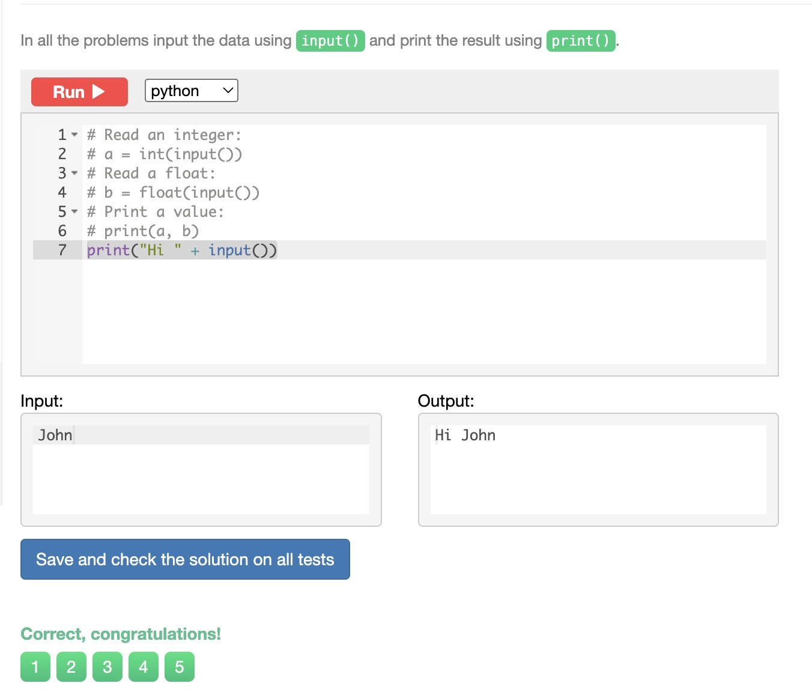
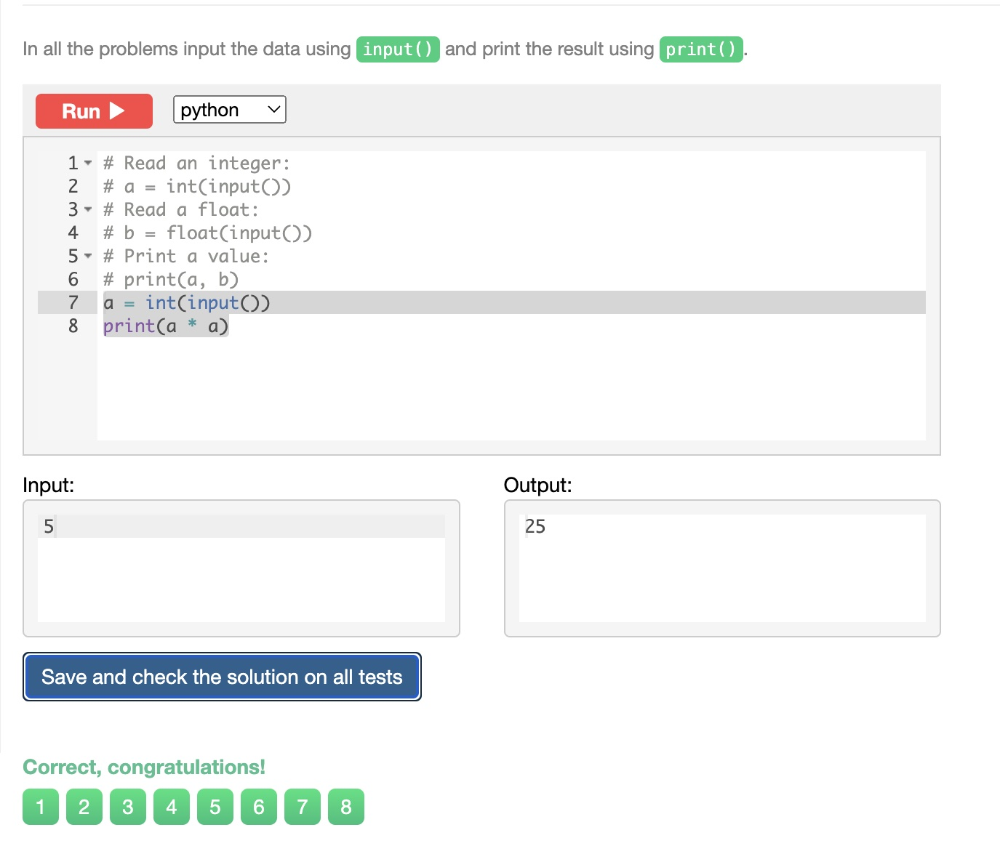
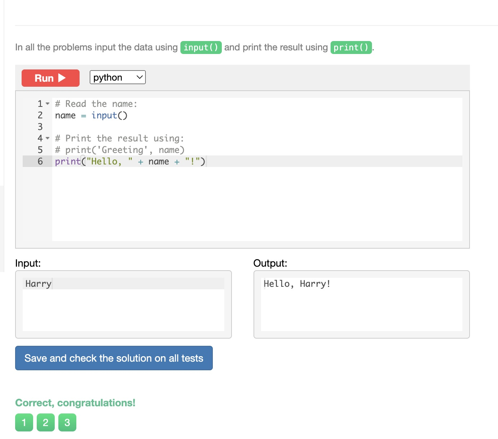

# Chapter 1

## Sum of 3 numbers
Write a program that takes three numbers and prints their sum. Every number is given on a separate line.


```.py
a = int(input())
b = int(input())
c = int(input())
print(a+b+c)
```


## Hi John
Write a program that greets the person by printing the word "Hi" and the name of the person. See the examples below.


```.py
print("Hi " + input())
```





## Square
Write a program that takes a number and print its square.


```.py
a = int(input())
print(a * a)
```





## Area of right-angled triangle
Write a program that reads the length of the base and the height of a right-angled triangle and prints the area. Every number is given on a separate line.


```.py
b = int(input())
h = int(input())
print(b * h / 2)
```


## Hello, Harry!
Write a program that greets the user by printing the word "Hello", a comma, the name of the user and an exclamation mark after it. See the examples below.


```.py
name = input()
print("Hello, " + name + "!")
```



